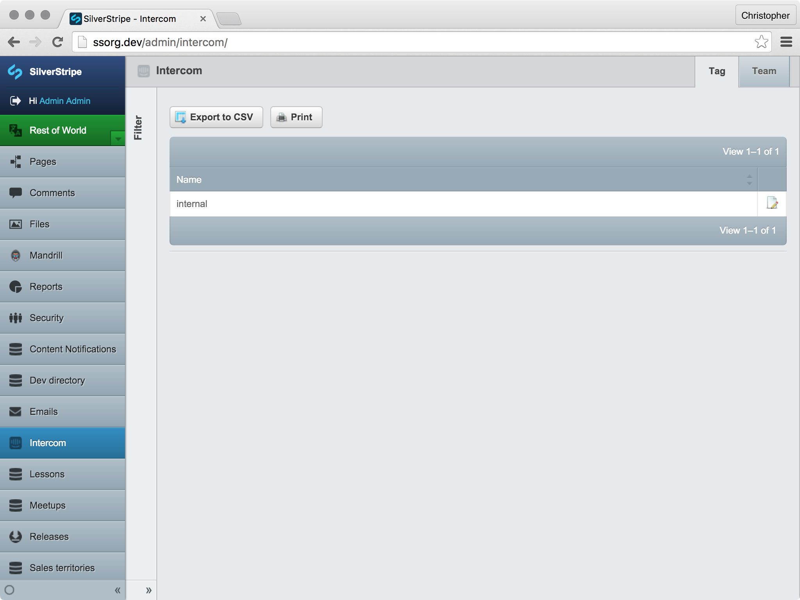
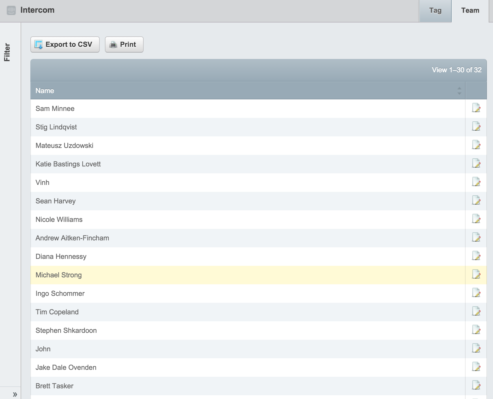

# Installation

Install the module with composer, just like all your favourite modules!

```sh
$ composer require silverstripe/intercom
```

The module comes with a ModelAdmin (for viewing and renaming Intercom tags and teams), so you can link them to your pages or data objects. This ModelAdmin is hidden by default, but you can show it with:

```yml
SilverStripe\Intercom\ModelAdmin:
    hidden: false
```

Changing this will make a few new screens visible, in the CMS:



> Managing tags



> Managing teams
